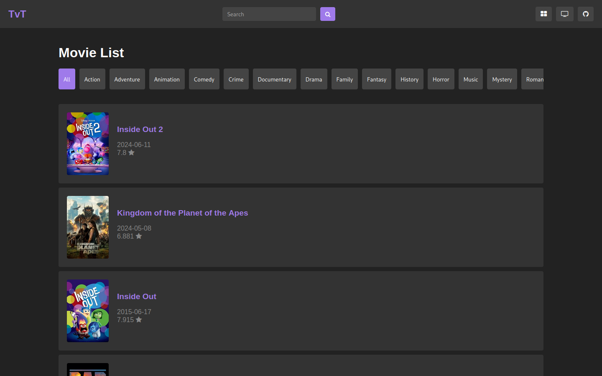

# TvT
(TvT is such a bad name, but I cant think of anything else- HELP ME AHHHHH)

Just your run of the mill streaming platform. Supports a variety of movies and shows pulled from the The Movie Database, otherwise known as TMDb coupled with a few embed APIs for your viewing pleasure. Should be easy enough for most folks to use!



## Usage

### Online Usage (Probably temporary. I dont have a host lol)
-   [Go here.](https://floramene.pythonanywhere.com)
-   Input your TMDb API Key into the box, and press submit.
-   And.. you're done!

### Offline Usage
-   Clone the repo:

    ```shell
    git clone https://github.com/Floramene/TvT
    ```
-   Cd to the working directory

    ```shell
    cd TvT/src
    ```
-   Start the Flask application

    ```shell
    python app.py
    ```
-   Navigate to your localhost (Generally `127.0.0.1:5000`)
-   Input your API Key into the box, and press submit!

## Hosting Agreements
Host it if you want! Hell, modify it if you want. Just link back to this repository as the base of it, that's all I ask.

## Contributions
Contributions are _MORE_ than welcome. My code is ass. Please improve it!!  
(Especially my CSS, good _lord_ it's horrible)


> [!WARNING]
> Note! This project was 100% inspired from [Nova](https://github.com/ambr0sial/nova/)  
> I started work on it because me and the creator were joking about what it'd be like if I made a streaming  
> service similar to theirs as well. So here's my own spin on it. Hope yall enjoy!


